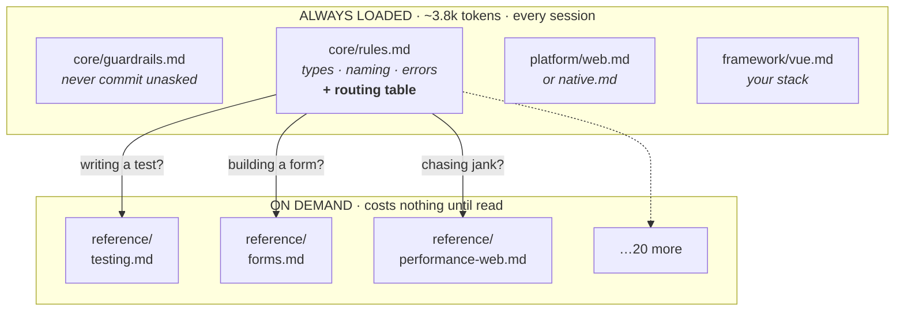

# ai-workflow-fe

`ai-workflow-fe` bootstraps engineering policy and workflows for AI-assisted
product teams. It installs portable standards, selective context routing,
guardrails, repository navigation, and tool-specific adapters without replacing
the project's architecture.

The adapters point Claude Code, Codex, Cursor, Copilot, Qwen Code, and Kimi Code
at shared standards for Next.js, React, Vue, Angular, and React Native.

After installation, supported agents can consult the project's conventions,
layout, test setup, and guardrails without repeating them in every prompt.

## Why this exists

If you work with more than one team, or more than one stack, you hit the same
wall: every project ends up with its own hand-written instruction file, they all
say slightly different things, and none of them stay current.

The mobile team's rules drift from the web team's. Someone tweaks a threshold and
nobody else finds out. Six months later there is no shared standard, just five
files that were once copies of each other.

This repo fixes that by keeping **one** set of rules and splitting them by what
actually differs. Most rules — how you name things, how you handle errors, what
"done" means — are genuinely identical everywhere. A smaller set differs because
the platform forces it: React Native has no CSS and no DOM, so styling and
accessibility rules genuinely cannot match the web. A smaller set again differs
because each framework has its own idiom worth respecting.

Shared policy has one canonical source. Tool wiring and mechanical enforcement
may repeat a constraint in executable form, but engineering policy changes in
one place and each project can pick it up on its next sync.

## What it looks like in practice

Say you ask your assistant for a user card component.

**Without this**, it guesses. It invents a folder structure, picks a styling
approach that may not be yours, possibly reaches for `any`, might not write a
test, and may well commit the result. Or worse - you have to do everything manually 
and nobody got time for that.

**With this**, it can consult your project's standards first. On a Vue project
those standards direct it toward `<script setup>` with typed props, composables
for data logic, the configured repository layout, and the selected test runner.
They also direct it to write the relevant test and show the diff without
committing.

You did not repeat any of that in your prompt. It was already installed.

## What it costs, and what it saves

This is worth being straight about, because it is not free.

**The fixed cost.** A typical project keeps about **2,300 words (roughly 3,800
tokens)** in resident instructions — the guardrails, core rules, platform,
framework, and entry file. Exact token counts depend on the agent tokenizer.

**What stays out.** Roughly 17,000 tokens of reference material and workflows sit
in the project unread. The eight reference files load only when the routing table
says they are relevant; the workflows load only when you invoke one. Adding a
rule set does not make every session more expensive.

**Where it saves.** Four places, in rough order of impact:

- **Rework.** The expensive tokens are the ones spent producing something on a
  wrong assumption and then producing it again. One avoided rewrite of a
  component covers several sessions of fixed cost.
- **Repeated explanation.** You stop restating conventions in prompts, and you
  stop re-explaining them three messages later when they were ignored.
- **Selective loading.** Detail arrives when it is relevant instead of always.
- **Shorter workflows.** "Follow `workflows/review.md`" replaces a paragraph
  describing what a review should cover.

**Where it does not.** For a one-line fix in a repo you know well, roughly 3,800 tokens
of standards is overhead you did not need. The economics only work when the
assistant would otherwise have guessed wrong — which is most of the time on an
unfamiliar codebase, and rarely on a two-minute change.

The honest summary is that this trades a predictable fixed cost for a reduction
in a variable one. It is a good trade on real work and a bad one on trivia.

## Quick start: guided setup

The wizard inspects an existing repository where possible, offers detected
defaults, and produces the same configuration as the manual installer. It shows
one consolidated file-change plan, the selected package manager, and trusted
executable commands before asking to write anything:

```bash
node scripts/standards.mjs init --target ../my-app
```

Use `--dry-run` to stop after the preview. CI and scripted environments can use
`--non-interactive` with explicit flags and `--yes`.

## Advanced/manual setup

Run this from this repo (or your fork), pointing at your app:

```bash
# 1. Preview — writes nothing, just shows you what would land
node scripts/standards.mjs install --target ../my-app --manifest vue --mode greenfield --adapter claude

# 2. Apply once the preview looks right
node scripts/standards.mjs install --target ../my-app --manifest vue --mode greenfield --adapter claude --apply
```

`--manifest` is your stack: `nextjs`, `react`, `vue`, `angular`, `react-native`.
`--mode` is `greenfield` for a new repo or `legacy` for an existing codebase.
`--adapter` is `claude`, `codex`, `cursor`, `copilot`, `qwen`, or `kimi`;
comma-separate multiple.

You get roughly 30 managed files, with a few more for Claude commands and
skills. The preview lists the files before installation:

```
standards/
  core/guardrails.md    the "always ask first" rules
  core/rules.md         the rules that apply to everything you write
  project.json          thresholds, tool choices, and opt-in capabilities
  execution.json        trusted local commands — humans review changes
  platform/ framework/ reference/
workflows/              step-by-step guides: component, test, review, verify…
```

One step remains. Run the check, and it will tell you exactly what is missing:

```bash
node scripts/standards.mjs check --target ../my-app
```
```
Installation invalid:
- greenfield execution commands.lint must be configured
- greenfield execution commands.test must be configured
- greenfield stack.styling must be configured; use "none" when deliberately unused
  …
```

Fill policy into `standards/project.json` and real validation commands into
trusted `standards/execution.json`, then run it again:

```
Standards 1.0.0: greenfield vue/web; policy and routes valid.
```

Now ask your assistant for something and it will follow the standards.

Later, when this repo gets updates:

```bash
node scripts/standards.mjs sync --target ../my-app
```

That previews the change. Add `--apply` to actually write it:

```bash
node scripts/standards.mjs sync --target ../my-app --apply
```

Your `project.json` and any exceptions you recorded are preserved. Add
`--remove-obsolete` if you also want files that left the manifest to be deleted.

### Adding a rule set later

The default install is small on purpose. When you hit something it does not
cover — your first real form, your first API integration — add that module:

```bash
node scripts/standards.mjs add-module --target ../my-app --module forms --apply
```

That copies the file, adds its row to the routing table, and updates the lock, so
your assistant starts using it immediately. `remove-module` reverses all three.

## Pointing your assistant at it

Pass `--adapter` during installation and the entry file is written for you:

| `--adapter` | Your tool | What lands |
| --- | --- | --- |
| `claude` | Claude Code | `CLAUDE.md`, plus commands and skills in `.claude/` |
| `codex` | Codex, Amp, Jules, Zed | `AGENTS.md` |
| `cursor` | Cursor | `.cursor/rules/standards.mdc` |
| `copilot` | Copilot | `.github/copilot-instructions.md`, generated |
| `qwen` | Qwen Code | `QWEN.md` |
| `kimi` | Kimi Code | `.kimi/AGENTS.md` |

Comma-separate to install several: `--adapter claude,cursor`. Then fill in the
"Project specifics" section of the entry file.

Windsurf and Aider have no dedicated adapter yet. Copy the `codex` entry to
`.windsurf/rules/` or `CONVENTIONS.md` and adjust — the content is the same.

**Running the workflows.** The Claude adapter installs commands and skills in
their native locations. Everywhere else, say *"follow `workflows/review.md`"*.

**Using two tools on one project is supported.** They consume the same shared
policy, reducing duplicated configuration and policy drift.

## Code Map

The generated Code Map gives agents a deterministic navigation index without
loading the full index into context:

```bash
node scripts/standards.mjs map build --target ../my-app
node scripts/standards.mjs map find "user status" --target ../my-app
node scripts/standards.mjs map check --target ../my-app
```

It records source files, imports, exports, symbol kinds, and basic usage links in
`.ai/code-map.json`. It excludes environment files, credential-like files,
dependencies, build output, vendor code, and generated directories. The map is
only a navigation aid: source files remain authoritative, and `map check`
reports changed, deleted, or renamed source as stale.

## Validation status and feedback

This release has local automated coverage on Windows for the installer, sync,
uninstall safety, policy validation, wizard flows, Code Map, and adapter
lifecycle. The suite runs 5 framework manifests in greenfield and legacy modes.
The GitHub Actions workflow also targets Ubuntu and Windows, but those hosted
runs still need to pass after the branch is pushed.

The project has not yet been exercised across a broad sample of real
repositories or every supported agent environment. Qwen and Kimi support is
based on their documented project-instruction mechanisms and local lifecycle
fixtures, not production use across multiple teams. Feedback is welcome,
especially when it includes the framework, agent, command used, expected result,
actual result, and a small reproduction where possible.

Known follow-up work:

- Replace or supplement Code Map's deterministic source patterns with a proper
  parser where regex extraction proves unreliable.
- Test hosted Linux and Windows CI and record any platform-specific filesystem
  failures.
- Run pilot installs with 5–10 external developers and collect installation
  friction, confusing choices, disabled rules, routing failures, and adapter
  demand.
- Add small benchmarking fixtures for tool calls, file reads, task time,
  validation failures, and correctness. Do not claim token savings before that
  evidence exists.

Longer-term Code Map ideas remain out of scope for v1: semantic summaries,
LLM-generated descriptions, a full call graph, watch mode, an IDE extension,
visual dependency graphs, an MCP server, embeddings, and cross-repository
indexes. Additional product integrations should wait until the current Figma and
Jira paths have real user feedback.

**Copilot is the exception.** It can't open files on demand, so its instruction
file is *generated* — the always-on rules and your resolved policy flattened into
one document. The detailed references and the workflows stay out of reach for it.

You do not regenerate it by hand. `sync` rebuilds it from your current policy,
and `check` fails if it has drifted:

```bash
node scripts/standards.mjs sync --target ../my-app --apply
```

## What each framework gets you

The core is the same everywhere. These are the stack-specific opinions you are
signing up for.

| Stack | Pushes you toward | Pushes back on |
| --- | --- | --- |
| **Next.js** | Server Components by default, `'use client'` at the leaves, Server Actions for mutations | Fetching in `useEffect`; secrets or full user objects crossing into the client |
| **React (SPA)** | A query library for server state, route-level code splitting, controller hooks | `useEffect` fetching; copying server state into `useState`; memoizing by reflex |
| **Vue 3** | `<script setup>`, composables returning readonly refs, Pinia with `storeToRefs` | Options API in new code; watchers that write to other refs; mutating props |
| **Angular** | Standalone components, `OnPush`, signal stores, `@if`/`@for` | NgModules; function calls in templates; subscribing without `takeUntilDestroyed` |
| **React Native** | `StyleSheet` at module scope, `accessibility*` props, keystore for tokens, `FlatList` discipline | Inline styles built in render; anything secret in the bundle; `map()` inside a `ScrollView` |

React Native is the one real fork. It swaps in a different platform file, so
inline styles become correct, `aria-*` becomes `accessibility*`, and automated
accessibility checking stops existing because there is no DOM. Everything else —
types, naming, error handling, testing philosophy, git conventions — is identical
to the web stacks.

If a team ever asks "why do we have different rules from them?", the answer is
laid out in [adoption/conformance.md](adoption/conformance.md), which separates
what is genuinely identical from what differs and why.

## Making it yours

Most numbers and tool choices are not fixed. They live in
`standards/project.json` in your project, and you edit them there:

```json
{ "limits": { "componentReviewLines": 300 } }
```

```json
{ "testing": { "snapshotPolicy": "allow-with-reason" } }
```

Executable commands live separately in `standards/execution.json`. This is
trusted executable configuration: agents must not modify it without explicit
human approval. String commands intentionally use the system shell for
compatibility; structured commands are invoked directly and are preferred where
practical. `commands.lint` runs at the end of a turn. On a
large or legacy repo you can add `commands.lintChanged`, which runs instead
whenever files have changed:

```json
{ "commands": { "lint": { "executable": "npm", "args": ["run", "lint"] }, "lintChanged": "npm run lint:changed" } }
```

Two things to know before you set it. The paths arrive as a JSON array in the
`AI_WORKFLOW_CHANGED_FILES` environment variable, not as arguments — **your
script has to read that variable**, or it will just lint everything. And once
`lintChanged` is set, a turn that changed no matching files skips linting
altogether rather than falling back to `commands.lint`.

Never edit the shared files under `standards/core`, `platform`, `framework`, or
`reference`. Those get replaced when you sync; your `project.json` does not.

Integrations are opt-in capabilities, never core standards. Install their
on-demand policy and workflows with `add-module --module figma` or
`add-module --module jira`, then enable only what the project uses:

```json
{
  "integrations": {
    "figma": { "enabled": true, "mode": "read", "componentMapping": true },
    "jira": { "enabled": true, "projectKeys": ["PROJ", "APP"], "write": "confirm" }
  }
}
```

An enabled integration must also have its module installed; `check` rejects an
enabled-but-missing capability. Jira project keys are an explicit boundary for
reads and writes. Access outside that list requires approval, independently of
the approval still required for every Jira write.

These values describe capability and permission policy only. Credentials and
sessions belong to the user's integration client and must never be committed.

Rules come in four strengths, which tells you what you are allowed to change:

- **Guardrails** — safety and authorization. Never commit unasked, never read a
  credential file, never quietly report success. These are not configurable.
- **Invariants** — shared engineering outcomes. Changeable, but it belongs in
  `deviations` with a reason, an owner, and a review date, so it expires instead
  of quietly becoming permanent.
- **Configurable policy** — thresholds, strictness, tools, integrations. Yours. Edit
  `project.json`.
- **Recommendations** — strong defaults that yield to evidence and to whatever
  architecture you already have.

The presets are starting points, not hidden behaviour. Once installed, every
value is written out explicitly where you can see and change it.

Treat the numeric limits as a review trigger. A cohesive 250-line component can
be perfectly fine; a 90-line one doing four unrelated things still needs
splitting. Crossing a threshold means someone should look, and nothing more.

## How it is put together

Read this if you plan to modify it.

Rules are split three ways by **what** they apply to:

```
standards/core/       true everywhere      types, naming, errors, comments
standards/platform/   web vs native        DOM/CSS vs StyleSheet/accessibility
standards/framework/  per framework        components, data flow, routing
```

And two ways by **when** they load. Four files are always in your assistant's
context — the guardrails, the core rules, your platform, and your framework.
That is roughly 3,800 tokens with the generic adapter entry. Exact counts vary by
stack and tokenizer.

Everything else — testing standards, git conventions, forms, performance,
accessibility audits — loads only when relevant. `standards/core/rules.md` opens
with a routing table that says, in effect, "writing a test? read this file
first." So the cost stays low without the detail being lost.



The installer prunes that routing table down to the files you actually installed,
so it never points at something that isn't there.

## Guardrails and enforcement

`standards/core/guardrails.md` is always loaded and overrides everything else:
never commit without approval, never add attribution trailers, never open a
credential file, never add a dependency unprompted. And a "never" you give it is
permanent — not lifted by a later vague instruction.

These cannot be load-on-demand. By the time an assistant thought to fetch "don't
commit without approval," it has already committed.

Enforcement comes in three strengths, and it is worth being clear-eyed about which
you actually have:

- **Prose** — the assistant should follow it. Advisory.
- **Tool config** — your tool asks, refuses, or runs a check automatically.
  Real, but only for that one tool.
- **Git hooks** — `enforcement/` has templates you adapt to your project's
  commands. Runs for everyone, including humans.

There is no universal CI backstop. An optional consuming-repo template lives at
`enforcement/standards-ci.yml`; copy and configure it with the source repository,
reviewed source ref, dependency install command, and trusted project commands
before treating the checks as CI-enforced. The hook template is also manual and
is not copied by the installer.

## Using it across several teams

If you are rolling this out rather than just using it, four documents cover the
human side:

- [adoption/rollout.md](adoption/rollout.md) — phased adoption. Never enforce
  retroactively; pilot with one team first
- [adoption/conformance.md](adoption/conformance.md) — what is identical across
  stacks and why the rest differs. The one to show a team lead
- [adoption/governance.md](adoption/governance.md) — who owns the standards, how
  someone proposes a change, how exceptions get recorded and expire
- [adoption/estate.md](adoption/estate.md) — keeping many repos aligned without
  demanding everyone be on the newest version

## Reference

<details>
<summary>All commands</summary>

Always pass `--adapter`. Without it you get the standards but no entry file, so
nothing loads them.

```bash
# Guided setup; always previews before confirmation
node scripts/standards.mjs init --target ../project

# Preview an installation; writes nothing
node scripts/standards.mjs install --target ../project --manifest vue --mode legacy --adapter claude

# Apply after reviewing the preview
node scripts/standards.mjs install --target ../project --manifest vue --mode legacy --adapter claude --apply

# Check an installed project
node scripts/standards.mjs check --target ../project

# Sync; preview first, then --apply. project.json and execution.json are preserved
node scripts/standards.mjs sync --target ../project
node scripts/standards.mjs sync --target ../project --apply

# Uninstall unmodified managed files; local and project-owned files are preserved
node scripts/standards.mjs uninstall --target ../project
node scripts/standards.mjs uninstall --target ../project --apply

# Add or drop an optional rule set
node scripts/standards.mjs add-module --target ../project --module forms --apply
node scripts/standards.mjs remove-module --target ../project --module forms --apply

# Build, query, and check the repository navigation index
node scripts/standards.mjs map build --target ../project
node scripts/standards.mjs map find "user status" --target ../project
node scripts/standards.mjs map check --target ../project

# Verify this repository itself (for maintainers)
node scripts/validate.mjs               # static checks, then real installs
node scripts/validate.mjs --fast        # static checks only; skips the install matrix
node scripts/validate.mjs --integration # same coverage as the full run, labelled for CI

# Run declared quality gates against an installed project (after dependencies exist)
node scripts/quality.mjs --target ../project
```

Install refuses to overwrite existing files. Sync compares hashes recorded in
`standards/install-lock.json`, stops if you edited a shared file, and needs
`--apply` to write anything. Lifecycle commands reject lockfile paths that leave
the target and refuse managed paths containing symbolic links.

Optional flags: `--adapter`, `--unit-test-runner`, `--e2e-runner`, `--styling`,
`--state-management`, `--server-state`, `--package-manager`. Each manifest has
a recommended default.
Use `--unit-test-runner project-existing` if you have a runner this repo does not
ship a reference for, then write its real name into `project.json`.

The tooling uses Node built-ins and installs no dependencies. This repository is
currently distributed from source rather than as an npm package. Your app can
use any package manager; its commands go in trusted
`standards/execution.json`.

</details>

<details>
<summary>Repository layout</summary>

```
standards/
  core/           always loaded · guardrails · rules · optional/i18n
  platform/       always loaded · web.md · native.md
  framework/      always loaded · nextjs · react · vue · angular · react-native
  reference/      on demand · 23 files, routed from core/rules.md
workflows/        portable task and end-to-end workflow docs
adapters/         claude · agents · cursor · copilot · qwen · kimi
enforcement/      optional git hook and CI templates; adapt before enabling
adoption/         rollout · conformance · governance · estate
manifests/        per-stack install sets
templates/        project presets, schema, tsconfig base
standards.json    version marker
```

</details>

<details>
<summary>All workflows</summary>

| Workflow | What it does |
| --- | --- |
| `init` | Bootstrap a new project — tsconfig, test utils, gates |
| `onboard` | Audit an existing repo → gap report and phased plan |
| `standards-sync` | Find version drift and local edits |
| `standards-lifecycle` | Carry adoption or upgrade through preview, validation, and reviewable delivery |
| `component`, `feature` | Scaffold to your stack |
| `deliver-feature`, `fix-bug` | Carry feature and bug work through implementation, proof, and review |
| `extract-logic` | Move data logic into a hook, composable, or service |
| `test` | Write a unit test |
| `verify` | Actually render the UI and look at it |
| `split` | Plan a split for an oversized component |
| `perf` | Bundle, render, and image audit |
| `api-types` | Generate types from OpenAPI and wire the CI check |
| `review`, `review-pr`, `draft-pr` | Review and PR flow |
| `precheck`, `anycheck`, `hardcoded`, `changelog` | Focused checks |
| `a11y`, `security-scan` | Audits, branching web vs native |
| `e2e-web`, `e2e-native`, `security-headers` | Platform-specific |

</details>

<details>
<summary>Why optional files are not installed by default</summary>

Every installed file is one someone has to keep current, and a stale standard is
worse than a missing one, because people trust it.

So the default install is the core set only. Each optional file carries the
trigger that should make you add it — "first form with real validation",
"monorepo only". Some are marked *promote early* where a stack makes them
near-certain.

Add or remove one safely; both commands update routing and the install lock:

```bash
node scripts/standards.mjs add-module --target ../my-app --module forms --apply
node scripts/standards.mjs remove-module --target ../my-app --module forms --apply
```

</details>

<details>
<summary>Adding a framework</summary>

One framework file, one testing reference, one adapter entry, one manifest.
`MAINTAINING.md` has the layering rules that keep it to that.

</details>

---

## HOW TO USE (SIMPLIFIED)

Run setup commands from this repo; point `--target` at the project you want to
work on. The examples below use a Vue app at `../my-app`. Swap the manifest and
adapter for your stack and assistant.

**Put the standards in an existing app.** Preview first, then apply. Fill in
`standards/project.json` and the real commands in `standards/execution.json`
before expecting checks to pass.

```bash
node scripts/standards.mjs install --target ../my-app --manifest vue --mode legacy --adapter codex
node scripts/standards.mjs install --target ../my-app --manifest vue --mode legacy --adapter codex --apply
node scripts/standards.mjs check --target ../my-app
```

**Build something across several files.** In the app, ask your assistant:

> Add a searchable FAQ with an empty state. Follow `workflows/deliver-feature.md`.

That workflow takes the request through the implementation, tests, applicable
browser checks, and a review of the whole diff. For one small component,
`workflows/component.md` is enough.

**Fix a regression.** Give the assistant a trigger and the expected result:

> Searching for "lodz" misses "Łódź". Reproduce it, fix it, and follow
> `workflows/fix-bug.md`.

**Add rules when the app needs them.** The first form with real validation is a
good time to add the forms module. This does not change the rest of your app.

```bash
node scripts/standards.mjs add-module --target ../my-app --module forms --apply
```

**Check the result.** The project must have its dependencies installed and
trusted commands configured before the quality runner can use them. For a UI
change, also ask the assistant to follow `workflows/verify.md` and inspect the
actual page at the relevant sizes.

```bash
node scripts/quality.mjs --target ../my-app
```

**Pick up a newer version.** Preview the sync and review local edits before
applying it. `workflows/standards-lifecycle.md` covers the same upgrade as a
reviewable task; the command does the file work.

```bash
node scripts/standards.mjs sync --target ../my-app
node scripts/standards.mjs sync --target ../my-app --apply
```

The CI and hook files in `enforcement/` are optional templates. Copying the
standards does not turn them on.

---

## Authorship

Built at **[alicein.dev](https://alicein.dev)**.

**Use it freely.** Fork it, gut it, rename it, ship it. Take the layering and
throw away the workflows. Take the workflows and throw away the layering. Delete
the frameworks you don't use, change every threshold, disagree with the opinions
and write your own — that is what the configurable layer is for. No attribution
required, no permission needed. MIT.

Expect your copy to diverge from this one. Whatever still holds up after you have
tailored it was worth keeping, and whatever you deleted was never load-bearing for
you.

Two things I would keep whatever else changes:

- **`standards/core/guardrails.md`** — everything else here is engineering
  opinion you can argue with. That file is about not handing an assistant
  unreviewed authority over your repository.
- **One source, many adapters** — the moment tool-specific rules leak back into
  the shared files, you are maintaining several copies again, which is the
  problem this structure exists to avoid.


